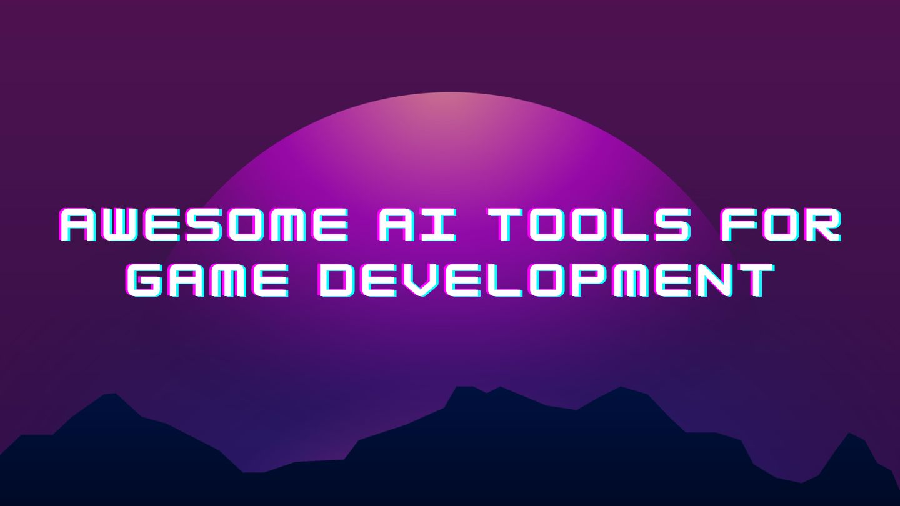

# Awesome AI Tools for Game Developers 

This is a curated **collection of powerful AI tools that accelerate and enhance game development**. From asset and texture generation to voice and speech recognition, these tools streamline the creation process. 

By integrating them into your workflow, **you can save time, automate tasks, and unlock creative possibilities**. 

Whether you're an indie developer or part of a studio, **this list provides cutting-edge AI tools to speed up your development, enabling you to create immersive games**. Discover the potential of AI in game development for greater efficiency and creativity.

Don't forget to ⭐ start the repo, this helps us 🤗.

You have other tools to add? **[Please contribute](https://github.com/simoninithomas/awesome-ai-tools-for-game-dev/pulls)**

## Contents
- [Asset Generation](#asset-generation-)
- [Texture Generation](#texture-generation-)
- [Image Generation](#image-generation-)
- [Code Generation/Assistant](#code-generationassistant-)
- [Animation video Mocap](#animation-video-mocap-)
- [Voice Generation](#voice-generation-%EF%B8%8F)
- [Speech Recognition](#speech-recognition-)
- [Conversational Models](#conversational-models)
- [Game Design](#game-design-)
- [Search Engine](#search-engine-)
- [AI NPC](#ai-npc)
- [Python Libraries](#python-libraries)
- [C# Libraries](#c-libraries)

## Asset Generation 🪄
➡️ When you want to **create a 2D or 3D asset for your game**.

- [Scenario.com](https://www.scenario.com/) (Proprietary, Sign Up, Free): Generate assets such as textures, concept art, and background assets.
- [Charmed Tilemap Generator](https://github.com/charmed-ai/tilemapgen) (Open Source, Free): Generate tilemaps for 2D levels.
- [Prometheanai](https://www.prometheanai.com/?via=topaitools) (Proprietary, Sign Up, Freemuim): Artificial Intelligence that generates virtual worlds.
- [Ready player me](https://readyplayer.me/) (Proprietary, Sign Up, Free): Generate and integrate avatars into games.

## Texture Generation 🖼️🖌️
➡️ When you want to **generate textures for your assets**

- [Charmed Texture Generator](https://charmed.ai/splash/texture-generator) (Proprietary, Sign Up, Free): Generate UV-unwrapped textures for complex 3D objects.
- [DreamTextures](https://github.com/carson-katri/dream-textures) (Open Source, Free): Create different types of textures with a **simple text prompt**.
- [Stable Diffusion](https://huggingface.co/spaces/stabilityai/stable-diffusion) (Open Source, Free)

## Image Generation 🖼️🪄
➡️ When you want to creating pictures of suspects in a detective game.

- [Midjourney](https://www.midjourney.com/home/) (Proprietary, Sign Up, Free, Paid)

- [Stable Diffusion](https://huggingface.co/spaces/stabilityai/stable-diffusion) (Open Source, Free)

- [Leonardo AI](https://app.leonardo.ai/) (Proprietary, Sign Up, Paid, Free Limited daily generations) 
    
- [ControlNet](https://github.com/lllyasviel/ControlNet-v1-1-nightly) (Open Source, Apache 2, Free)

## Code Generation/Assistant 👩‍💻
➡️ When you want **help in coding a function or there’s a bug in your code** and you want to know why.

- [StarCoder](https://huggingface.co/bigcode/starcoder) (Open Source, Free, Sign Up)

- [ChatGPT](https://chat.openai.com/) (Proprietary, Free, Paid,  Sign Up)

- [Copilot](https://github.com/features/copilot) (Proprietary, Paid,  Sign Up)

## Animation Video Mocap 💃📹
➡️ You want to **generate 3D animations from a video you’ve made without a motion capture suit**.

- [Plask](https://motion.plask.ai/) (Proprietary, Free, Paid,  Sign Up) : AI-powered Mocap
Animation Tool.

- [RadicalMotion.com](https://radicalmotion.com/) (Proprietary, Free, Paid,  Sign Up)

## Voice Generation 🗣️
➡️ You want to create **voice dialogues in my game using AI actors**.
➡️ [How does it work](https://huggingface.co/tasks/text-to-speech)

- [Coqui Studio](https://coqui.ai/) (Sign Up, Proprietary, Free): realistic, emotive text-to-speech through generative AI.

- [Bark](https://github.com/suno-ai/bark) (Open Source): Bark can generate highly realistic, multilingual speech as well as other audio - including music, background noise and simple sound effects. 

- [Replica Studios](https://replicastudios.com/) (Sign Up, Proprietary, Free): AI voice actors for games

## Speech Recognition 💬
➡️ You want the player to be able to give orders using his voice.
➡️ [How does it work](https://huggingface.co/tasks/automatic-speech-recognition)

- [OpenAI Whisper](https://huggingface.co/openai/whisper-base): model for automatic speech recognition (ASR) and speech translation.

- [Facebook Wav2Vec2](https://huggingface.co/facebook/wav2vec2-large-xlsr-53): another model for multilingual automatic speech recognition (ASR).

## Conversational models
➡️ You want your NPC to be able to have conversations with the player.
➡️ [How does it work](https://huggingface.co/tasks/conversational)

- [ChatGPT](https://chat.openai.com/) (Proprietary, Free, Paid, Sign Up): Conversational model for chat-based interactions.

- [HuggingChat 🤗](https://huggingface.co/chat/): (Open Source, Free, Sign Up): Open-source conversational model for chat-based interactions.

## Story Telling Models
➡️ Want to make that crazy lore for your world with a lot of text?

- [MPT-7B-StoryWriter-65k+](https://huggingface.co/mosaicml/mpt-7b-storywriter) (Open Source, Apache-2.0, Free)
  
- [Claude 100k](https://www.anthropic.com/index/100k-context-windows) (Proprietary, Paid, API access, Waitlisted)

- [GTP-4 32k](https://platform.openai.com/docs/models/overview) (Proprietary, Paid, API access, Waitlisted)
  
## Game Design 🎮
➡️ You want to generate game mechanics, game ideas, or other other components of your game (characters, story, items, etc.).

- [Ludo.ai](https://ludo.ai/) (Proprietary, Sign Up, Free, Paid): Ideation and research tool for game designers and developers, combining text and image generation with AI-powered search and trends tools.

## Search Engine 🔍
➡️ Want to search scripts generated using advanced LLMs like GPT-4? 

- [Haddock](https://www.haddock.ai/) (Proprietary, Sign Up, Free, Paid): Search AI-Generated Code for free from GPT-4, Copilot, etc. Generate code for gaming platforms such as Roblox, Unity, and Unreal. 

## AI NPC

- [Inworld](https://inworld.ai) (Proprietary, Sign Up, Paid, Free Limited daily Interactions): Create a personality for your NPCs
- [eastworld](https://github.com/mluogh/eastworld) (Open Source, Apache 2, Free): Create NPCs with backstories, knowledge about your lore, dialects, etc. that come out-of-the-box with capabilites like taking actions in your world
    
## Python Libraries 

- [NeMo Guardrails](https://github.com/NVIDIA/NeMo-Guardrails) (Open Source, Apache 2, Free): Limit what a NPC could talk about

- [Guidance](https://github.com/microsoft/guidance) (Open Source, MIT, Free): A library to help your LLM to understand your prompts
     
## C# Libraries

- [Hugging Face API Unity Integration](https://github.com/huggingface/unity-api)(Open Source, Apache 2, Free): Integration for the Hugging Face Inference API and Unity

- [UnityMLPySocket](https://github.com/dylanebert/UnityMLPySocket) (Open Source, Free): Perform local machine learning (ML) inference with Unity using a Python socket server. 

- [Python.Net](https://github.com/pythonnet/pythonnet) (Open Source, MIT): Integrate Python libraries with .Net and .Net Libraries with Python
     
